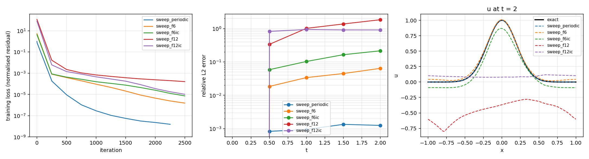
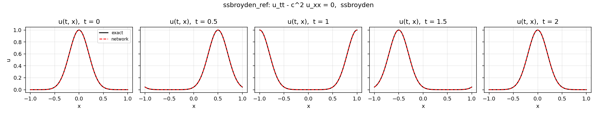
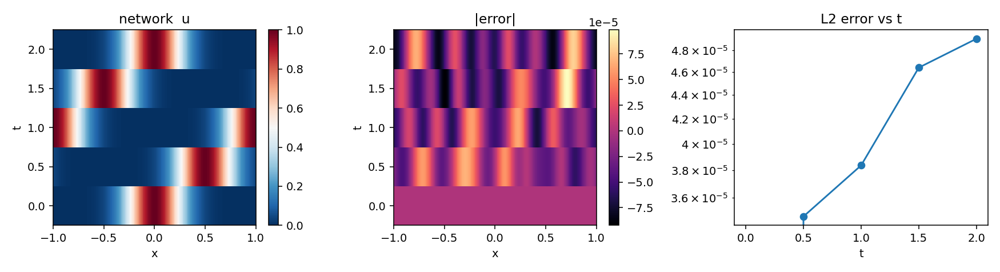
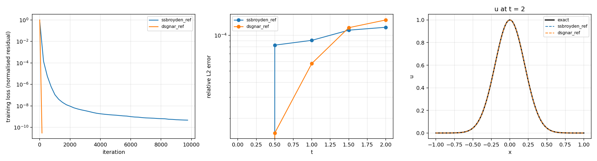
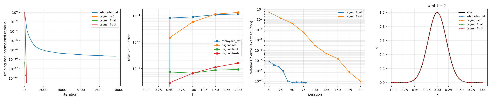
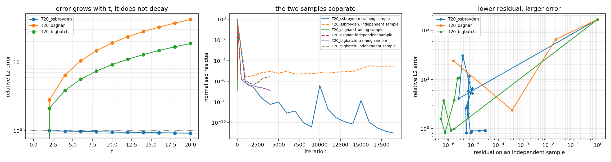

# Evolution_try — a PINN for the 1+1 wave equation, with SSBroyden and DSGNAR

A small, deliberately scheme-oriented JAX project for solving the second-order
wave equation in one spatial dimension with a physics-informed neural network,
plus a faithful port of the Gauss–Newton optimiser from the paper in `docs/`.

This directory is self-contained: everything it needs is here, including a
vendored copy of the `Crunch` SSBroyden implementation.

---

## 1. The problem

$$
u_{tt} - c^2 u_{xx} = 0, \qquad x \in [-L, L],\quad t \in [0, T],
$$

with `L = 1`, `c = 1`, `T = 2`, **periodic** boundary conditions in `x`, and
initial data

$$
u(0, x) = u_0(x), \qquad u_t(0, x) = v_0(x) = -c\,u_0'(x).
$$

The default initial profile is the Gaussian `u0(x) = exp(-x²/(2·0.2²))`. With
`v0 = -c u0'` the exact solution is the pure right-moving wave

$$
u(t, x) = u_0(x - ct),
$$

because the d'Alembert decomposition `u = F(x-ct) + G(x+ct)` with those two
initial conditions forces `G' = 0` and `F = u0`. With `c = 1` and `T = 2` the
pulse travels exactly one period, so `u(2, x) = u(0, x)`.

### The initial condition is hard-coded, not fitted

The network is

$$
\boxed{\;u_\theta(t, x) = u_0(x) + t\,v_0(x) + t^2\,N_\theta(\varphi(t,x))\;}
$$

so `u_θ(0, x) = u0(x)` and `∂_t u_θ(0, x) = v0(x)` hold **exactly, for every
parameter vector**. There is no initial-condition loss term anywhere in this
project, and no initial-condition weight to tune. The network only has to learn
the part of the solution that grows like `t²`.

### The boundary condition is hard-coded too

Periodicity is imposed by the *feature map*: the network input is

$$
\varphi(t, x) = \bigl(t/T,\ \cos(\pi x/L),\ \sin(\pi x/L)\bigr),
$$

i.e. the **plain network on the unit-amplitude sine/cosine pair**, with no
frequency expansion of any kind.  Every function built from those features is
`2L`-periodic, so `u(t, -L) = u(t, L)` for every parameter vector, and no
periodic penalty term is needed (one is available — `w_periodic` — but it could
only penalise the part of the ansatz the network cannot change).

One harmonic is enough, and adding more actively hurts.  The map
`x ↦ (cos(πx/L), sin(πx/L))` sends `[-L, L]` one-to-one onto the unit circle, so
a *nonlinear* network fed those two numbers can represent **any** `2L`-periodic
function of `x` — including the width-`0.2` pulse.  Extra harmonics add no
representational power; they add frequencies the optimiser has to fit, and §6.1
measures what that costs.

There is one wrinkle, handled in `wave_pinn/problem.py`: a Gaussian of width
`0.2` on `[-1, 1]` is *not* 2-periodic (it is `3.7e-6` at the ends, with a
non-zero slope there), and neither is `v0`.  The initial profile is therefore
replaced by its smooth periodic sum `u0_per(x) = Σ_n u0_raw(x + 2nL)`, which is
analytic and exactly periodic; on `[-1, 1]` it differs from the raw Gaussian by
less than `4e-6`.  Without that step the hard-coded part would break the
periodicity of the ansatz by about `2·10⁻⁴` at `t = 2`, and no amount of network
training could repair it.

---

## 2. What makes this problem hard

With this ansatz the exact remainder is

$$
N_{\text{exact}}(t,x) = \frac{u_0(x-ct) - u_0(x) + t\,u_0'(x)}{t^2}
   = u_0(x)\cdot\frac{e^{(xt - t^2/2)/\sigma^2} - 1 + xt/\sigma^2}{t^2},
$$

using `u0(x-t) = u0(x)·exp((xt - t²/2)/σ²)`. Two consequences shape every design
decision below:

1. **The hard-coded part is only a good approximation for small `t`.** It is the
   first two terms of the Taylor expansion of `u0(x-t)` in `t`, and at `t = 2`
   that expansion is worthless — the network has to cancel an `O(1)` smooth
   background to recover a pulse that has moved two units away.
2. **`N_exact` contains the narrow Gaussian at every order.** Its `x`-dependence
   is `u0(x)` times a *smooth* function, and the smooth factor is large (up to
   `e^{12.5}` on this domain) exactly where `u0` is small.  The network therefore
   has to represent a width-`0.2` feature, which is why §6.1 spends effort on
   what the input features let it see; the plain `(t, cos, sin)` map wins because
   a nonlinear network can build that feature from the two periodic coordinates,
   whereas a truncated Fourier series cannot.

---

## 3. Layout

```
Evolution_try/
├── README.md                     this file
├── docs/
│   ├── dsgnar_spec.md            page-cited specification of the paper (Algorithms 1-5,
│   │                             operators, hyperparameters, gotchas, reference code)
│   └── 2607.02194v1.pdf          the paper itself
├── wave_pinn/
│   ├── config.py                 every knob, one dataclass, JSON serialisable
│   ├── problem.py                u0, v0, the exact solution, the PDE residual
│   ├── features.py               the input feature maps (plain / fourier / *_ic)
│   ├── model.py                  the MLP and the hard-constrained ansatz
│   ├── sampling.py               collocation samplers and the residual normalisation
│   ├── losses.py                 the residual vector and the Objective wrapper
│   ├── optim/
│   │   ├── adam.py               Adam (warm-up or standalone)
│   │   ├── ssbroyden.py          Crunch's self-scaling Broyden, in blocks
│   │   ├── dsgnar.py             doubly-sketched Gauss-Newton with adaptive ratio
│   │   └── trustregion.py        exact-Hessian trust region (Xu & Darve)
│   ├── evaluate.py               error metrics and plots
│   ├── train.py                  the driver: build, optimise, measure, save
│   ├── compare.py                one table over every run in runs/
│   ├── plot_runs.py              loss curves and error-vs-t for several runs together
│   └── cli.py                    command line entry point
├── scripts/
│   ├── sweep_features.sh         the feature-map sweep
│   ├── run_reference.sh          the reference SSBroyden solve
│   ├── run_dsgnar.sh             the DSGNAR solve
│   ├── hessian_spectrum.py       measure the exact Hessian's eigenvalues
│   └── t20_diagnosis.py          the T = 20 figure: loss against error
├── tests/test_wave_pinn.py       unittest suite (no pytest needed)
├── vendor/Crunch/                vendored SSBroyden (from this repo's Jax/Crunch)
└── runs/<label>/                 one directory per run, see §5
```

Each run directory contains `config.json` (everything needed to reproduce it),
`theta.npy` (the flattened parameters), `history.json` (loss history, phase
information, error metrics), `fields.npz` (the fields on a test grid),
`report.md`, and three plots (`solution.png`, `error_map.png`, `loss.png`).

---

## 4. Running it

The project's interpreter is the one that has JAX:

```bash
PY=/Users/reula/jax_env/bin/python
cd /Users/reula/Julia/PINN/Evolution_try
export MPLCONFIGDIR=/tmp/mpl-wazepinn     # matplotlib's cache dir is not writable

# the reference solve (SSBroyden, to convergence)
bash scripts/run_reference.sh

# the paper's optimiser on the same problem
bash scripts/run_dsgnar.sh

# a one-off, with any field overridden
$PY -m wave_pinn.cli --label my_try --set optimizer=adam+ssbroyden \
    --set features=fourier --set n_modes=8 --set n_coll=4096

# what have I got so far?
$PY -m wave_pinn.compare --out runs/COMPARISON.md

# loss curves and errors of several runs on one figure
$PY -m wave_pinn.plot_runs --runs ssbroyden_ref dsgnar_ref --out runs/comparison.png

# the tests
$PY -m unittest discover -s tests -v
```

`--set key=value` works for every field of `Config` (see `config.py`), values are
coerced to int/float/bool/JSON automatically, and `--config runs/<label>/config.json`
restarts from a previous run's configuration. `--dry-run` prints the resolved
config without running anything.

Set `CRUNCH_ROOT` to point at a different `Crunch` checkout if you do not want
the vendored copy.

---

## 5. The schemes available

Every row is a config field; nothing here needs a code change to switch.

| Knob | Values | Meaning |
|---|---|---|
| `equation` | `wave2`, `advection` | `u_tt - c²u_xx = 0` or `u_t + c u_x = 0` |
| `ansatz` | `t2`, `t` | `u0 + t v0 + t²N` (both initial conditions) or `u0 + t N` |
| `features` | `periodic`, `periodic_ic`, `fourier`, `fourier_ic`, `plain`, `plain_ic` | `(t, cos, sin)` — the default; `fourier` adds harmonics `n = 1…K`; `*_ic` also feeds `u0`, `v0`; `plain` feeds a raw `x` (not periodic, diagnostics only) |
| `n_modes` | any integer | harmonics `K`, used only by `features="fourier"` |
| `sampler` | `uniform`, `random`, `grid_random`, `lhs` | collocation points |
| `n_coll` | any integer | collocation points; `0` (default) = one per trainable parameter |
| `residual_norm` | `auto`, `none` | divide the residual by its batch scale (a conditioning device) |
| `optimizer` | `adam`, `ssbroyden`, `adam+ssbroyden`, `dsgnar`, `adam+dsgnar`, `trustregion`, `adam+trustregion` | optimiser, or a warm-up followed by one |
| `tr_*` | see `config.py` | the trust-region Newton knobs: radius, eta, `tr_hessian` (`exact` or the `gauss_newton` ablation) |
| `n_layers`, `n_neurons` | any | architecture (default `6 × 20`, the requested one) |
| `activation` | `tanh`, `sin`, `gelu`, `relu`, `softplus` | |
| `init` | `glorot`, `lecun`, `siren`, `uniform`, `zeros` | |
| `periodize_ic` | bool | use the smooth periodic sum of `u0` (§1) |
| `w_periodic`, `w_l2` | floats | optional extra penalty terms (default off) |
| `resample_every`, `min_resamples` | int | redraw the collocation points every N steps, but at least `min_resamples` times per phase |
| `plateau_tol`, `plateau_patience` | floats/int | stop the quasi-Newton phase when it stops improving |
| `init_from` | path | warm start from a previous run's `theta.npy` (or its directory) |

### The optimisers

* **SSBroyden** (`ssbroyden`, the default). Optim.jl's self-scaling Broyden
  recurrence, as ported to JAX by `Crunch` (`update_method="ssbroyden2"`). The
  dense inverse Hessian is `n_parameters²` — 46 MB here — which is exactly why
  this project uses a 6 × 20 network. `Crunch` has no per-iteration callback, so
  the phase runs in blocks and carries `H` across block boundaries; the
  reasoning is documented at the top of `optim/ssbroyden.py`.
* **DSGNAR** (`dsgnar`). The paper's doubly-sketched Gauss–Newton with adaptive
  ratio: a *square* `s × s` sketch `J̃ = C J ΩS` (CountSketch on the rows, a
  subsampled orthonormal DCT on the columns), one SVD of it, and from that SVD a
  Levenberg–Marquardt step for every candidate trust-region radius at once; the
  radius whose measured decrease ratio is closest to a target `ϱ*` is chosen,
  and `ϱ*` steps up from `0.15` to `0.5` once the regularisation `λ` has bottomed
  out. `wave_pinn/optim/dsgnar.py` documents every place where the paper, its
  Algorithm boxes and the authors' reference code disagree, and which one was
  followed.
* **Adam** (`adam`, or as a warm-up in `adam+ssbroyden`). Included because PINN
  practice usually starts with it; it plateaus orders of magnitude above the
  quasi-Newton phases on this problem.
* **Trust-region Newton** (`trustregion`) — the optimiser of Xu & Darve,
  arXiv:2105.07552, and the third scheme this project was asked to carry.  It uses
  the **exact dense Hessian**, which is what makes it different from DSGNAR: the
  Gauss-Newton part `J^T J` plus `Σ_i r_i ∇²r_i`, and that second term is what
  makes the model indefinite.  See §6.7.

### Stopping criteria

Each phase reports why it stopped in `info["stopped"]`, which is printed and
written into every run's `report.md`.  There is no single criterion, and it is
worth knowing which one actually fires.

**SSBroyden**, inside one `Crunch` call (a *block* of `qn_block` iterations):

| status | meaning |
|---|---|
| 0 | converged: `‖∇L‖∞ < qn_gtol` (default `1e-14`) |
| 1 | the block's iteration budget ran out — the normal case |
| 3 | the Wolfe line search's zoom failed, which is normal once the gradient is tiny |
| 5 | the line search hit its own iteration cap |

**SSBroyden**, across blocks (`optim/ssbroyden.py`):

| `stopped` | condition |
|---|---|
| `converged` | a block returned status 0 |
| `plateau` | relative gain per block ≤ `plateau_tol` for `plateau_patience` consecutive blocks |
| `no progress` | a block returned zero iterations and did not improve |
| `diverged` | non-finite loss |
| `budget` | `round(qn_steps / qn_block)` blocks were run |

**DSGNAR** (`optim/dsgnar.py`):

| `stopped` | condition |
|---|---|
| `radius below threshold` | trust-region radius `< 10 · dsgnar_delta_min` (default `1e-13`) |
| `budget` | `dsgnar_steps` iterations were run |
| `diverged` | non-finite loss |

With that on the record: **`runs/ssbroyden_ref` and `runs/dsgnar_ref` both stopped
on `budget`, not on convergence.**  SSBroyden had 9753 iterations (fewer than the
10000 asked for, because its first block returned after 3 with status 3) and was
still improving by ~3 % per block, forty orders of magnitude above its plateau
tolerance.  DSGNAR stopped at 150 iterations with a trust-region radius of
`1.36e-2`, eleven orders of magnitude above its own threshold.  Neither run was
finished; §6.5 runs both further.

### Collocation redraws

The residual is estimated on a finite sample, and a frozen sample is eventually
*fitted* rather than estimated.  `resample_every` (default 250 steps) turns on
redraws, and the interval between them grows geometrically
(`resample_growth`, default 1.5) from an early first redraw:

| phase | budget | first redraw | redraws scheduled |
|---|---|---|---|
| SSBroyden | 8000 | 200 | 10 |
| DSGNAR | 250 | 6 | 10 |
| DSGNAR | 150 | 4 | 10 |

The interval is sized so that `min_resamples` (default 5) redraws land inside the
first eighth of the budget, and it grows because early iterations move the
solution a lot and later ones barely at all.  Sizing redraws against the *budget*
alone is not enough: DSGNAR converges here in tens of iterations, so a
budget-sized interval fires once or twice — measured, a run that converged at
iteration 69 under `resample_every=25` with a 250-iteration budget got exactly
two redraws.  Each phase reports the count it actually performed in
`info["resamples"]`, which is what the runs in §6.5 quote.

Redrawing only works with a stochastic sampler; `sampler="uniform"` is a
deterministic tensor grid that ignores the key, so `validate()` rejects that
combination rather than silently redrawing the same points — which is exactly
what happened during development: the redraw messages printed, and the loss, the
points and the normalisation constant were all bit-identical before and after.

The sample size defaults to **one collocation point per trainable parameter**
(`n_coll=0` means "resolve to the parameter count").  Below that the residual is
under-determined and the sampled loss can be driven to zero while the solution
drifts; far above it each iteration costs more for little extra signal.

---

## 6. Results

Everything below is reproducible with the scripts in `scripts/`; the runs are
kept under `runs/`, each with its `config.json`, and the table in
`runs/COMPARISON.md` is regenerated by `python -m wave_pinn.compare`.

### 6.1 Which input feature map

Identical budget throughout: 2048 random collocation points, 2500 SSBroyden
iterations, `qn_block = 250`, seed 0.

| features | modes | final loss | rel `L2` (space-time) | rel `L2` at `t=2` | wall |
|---|---|---|---|---|---|
| **`periodic`** | 1 | **1.55e-08** | **9.96e-04** | **1.25e-03** | 425 s |
| `fourier` | 6 | 1.54e-06 | 3.90e-02 | 6.41e-02 | 294 s |
| `fourier_ic` | 6 | 7.40e-06 | 1.32e-01 | 2.15e-01 | 339 s |
| `fourier` | 12 | 1.62e-04 | 1.13 | 1.84 | 270 s |
| `fourier_ic` | 12 | 1.04e-05 | 8.00e-01 | 9.06e-01 | 337 s |



Read across: adding harmonics makes matters monotonically worse, which is the
opposite of the usual intuition, and the reason is in §1 — the harmonics do not
add representational power (the two periodic coordinates already span every
periodic function), they only add directions for the optimiser to get wrong.
Handing the network `u0` and `v0` as extra *inputs* (`*_ic`) also hurts here: the
profile is a sharp input, and the resulting residual landscape is harder to
descend than the one where the network has to build the pulse itself.

### 6.2 The reference SSBroyden solve

`runs/ssbroyden_ref` — the requested configuration, 4096 collocation points,
SSBroyden from a random initialisation, no Adam.

| | |
|---|---|
| parameters | 2201 (6 layers × 20 neurons, `tanh`, `d_in = 3`) |
| iterations | 9753 (39 blocks of 250) |
| final training loss | 4.70e-10 |
| **space-time relative `L2`** | **9.04e-05** |
| wall time | 71 min (single CPU) |

| `t` | rel `L2` | max abs. error |
|---|---|---|
| 0.0 | 0.0 (hard-coded) | 0.0 |
| 0.5 | 8.26e-05 | 6.80e-05 |
| 1.0 | 9.06e-05 | 7.23e-05 |
| 1.5 | 1.10e-04 | 9.85e-05 |
| 2.0 | 1.17e-04 | 8.58e-05 |




The `t = 0` error is exactly zero because the initial condition is hard-coded,
not fitted; the error that remains grows slowly with `t` and is a striped
`~10⁻⁵` pattern in space-time, i.e. the network's residual noise, not a visible
distortion of the pulse.

### 6.3 DSGNAR on the same problem

`runs/dsgnar_ref` — the paper's optimiser, 2048 collocation points, sketch rank
`s = 733 = floor(d_θ/3)`, 25 probes per iteration.

| | SSBroyden | DSGNAR |
|---|---|---|
| iterations | 9753 | **150** |
| wall time | 4279 s | **918 s** |
| final training loss | 4.70e-10 | **2.98e-11** |
| space-time relative `L2` | **9.04e-05** | 8.37e-05 |
| rel `L2` at `t = 2` | **1.17e-04** | 1.35e-04 |
| per-iteration cost | 0.44 s | 6.1 s |



DSGNAR needs 65× fewer iterations and about 4.7× less wall time to reach the
same error. Each of its iterations is ~14× more expensive, because it builds a
fresh sketched Jacobian by 733 batched Jacobian-vector products and then
evaluates 25 trust-region probes in the full space, against SSBroyden's single
gradient per iteration.

Two things are worth recording from the log. First, the measured decrease ratio
sits at `0.146–0.158` for the whole run, i.e. on the stage-1 target `0.15` it was
asked for — the ratio machinery is calibrated, not merely non-diverging. Second,
every step was accepted and the stage-2 switch never fired, because the
regularisation `λ` fell to `~10⁻⁹` and then stopped climbing (the run hit its
150-iteration budget with the radius still shrinking). Both are visible in
`runs/dsgnar_ref/history.json`.

### 6.4 What the two optimisers cost here

The quasi-Newton inverse Hessian is `n_parameters²`; at 2201 parameters that is
39 MB, which is affordable only because the network is small — this is the same
trade that makes the 6 × 20 architecture the right one for the comparison. If
the network were widened, DSGNAR would still run (its cost grows with the sketch
rank `s`, not with `n`), while SSBroyden would not.

### 6.5 Running both further

Both §6.2 and §6.3 stopped on their iteration budget, so the obvious next
question is whether more iterations buy accuracy.  The answer is **no for
SSBroyden and a further 115× for DSGNAR**, and the difference is visible in the
independent-sample residual.

| run | optimiser | points | redraws | iterations | stopped | final loss | rel `L2` | rel `L2` at `t=2` | wall |
|---|---|---|---|---|---|---|---|---|---|
| `ssbroyden_ref` | SSBroyden | 4096 frozen | 0 | 9753 | budget | 4.70e-10 | 9.04e-05 | 1.17e-04 | 4279 s |
| `ssbroyden_cont` | SSBroyden | 8192 frozen | 0 | 3000 | budget | 3.96e-10 | 7.81e-05 | 1.12e-04 | 671 s |
| `ssbroyden_resample` | SSBroyden | 2201 | 10 | 8000 | budget | 3.75e-10 | 2.27e-04 | 4.05e-04 | 1360 s |
| `dsgnar_ref` | DSGNAR | 2048 frozen | 0 | 150 | budget | 2.98e-11 | 8.37e-05 | 1.35e-04 | 918 s |
| **`dsgnar_final`** | DSGNAR | 2201 | 7 | 86 | radius below threshold | 3.50e-14 | **7.25e-07** | **9.25e-07** | 645 s |
| `dsgnar_fresh` | DSGNAR | 2201 | 8 | 206 | radius below threshold | **1.14e-15** | 9.38e-07 | 1.61e-06 | 1964 s |



**SSBroyden is finished.**  Three attempts — 3000 more iterations on a larger
frozen sample, and 8000 iterations with the points redrawn — moved the error from
9.0e-05 to 7.8e-05 and then to 2.3e-04.  The third panel of the figure is the
diagnosis: with redraws, SSBroyden's error *oscillates* between 0.9 and 2.5e-04
while its independent-sample residual sits flat at ~6e-10 for the whole run.  It
is not converging further; it is random-walking on sampling noise around a
residual floor of a few times `10^-10`.  The redraws also cost accuracy relative
to the frozen 4096-point run, which is why the resampled run is the worse of the
two: at this residual level the sample-to-sample variation of the loss is larger
than the improvement per block.

**DSGNAR is not.**  Restarted from its own 150-iteration checkpoint with a
trust-region radius of `0.05` and the points redrawn 7 times, it drove the
residual from 2.9e-11 to 3.5e-14 and the error from 8.4e-05 to **7.2e-07** in 86
iterations, then stopped because its trust region collapsed below
`10·dsgnar_delta_min` — a real convergence criterion rather than a budget.  The
train and independent-sample losses agree to a few per cent at every probe
(`3.50e-14` vs `3.37e-14` at the end), so this is a genuine solution and not a
sample being fitted.  An earlier, independently scheduled run of the same
continuation reached `2.07e-06`, so the result is reproducible to about a factor
of three.

**From a random initialisation it is the same story.**  `dsgnar_fresh` starts
from the glorot initialisation (not from a checkpoint), with `Δ₀ = 1`, and needs
206 iterations to reach a residual of `1.1e-15` and an error of `9.4e-07` — no
warm start, no Adam, no hand-holding, and it still stops because the trust region
collapsed rather than because the budget ran out.  The right-hand panel of the
figure is its error against iteration: a straight line through eight orders of
magnitude.  The train and independent-sample losses agree at every probe
(`1.14e-15` against `2.58e-15` at the end), and the eight collocation redraws are
what make that agreement meaningful.

The consequence for the architecture is the interesting part: the `~10^-4` floor
that SSBroyden sits on is **not** a representational limit of the 6 × 20 network.
The same 2201 parameters represent the exact solution to `7·10^-7`; SSBroyden
simply cannot find it, which is precisely the ill-conditioning argument the paper
makes.

### 6.6 T = 20: where the loss stops predicting the error

The same two optimisers, run to `T = 20` (ten periods) on the same `[-1, 1]`
domain, with the tolerances opened right up: `qn_gtol = 1e-16`,
`plateau_tol = 1e-12`, `dsgnar_delta_min = 1e-15`.

| run | optimiser | points | iterations | stopped | final loss | rel `L2` | rel `L2` at `t=20` |
|---|---|---|---|---|---|---|---|
| `T20_ssbroyden` | SSBroyden | 2201 | 19763 | budget | **6.98e-12** | 9.07e-01 | 9.17e-01 |
| `T20_dsgnar` | DSGNAR | 2201 | 97 | radius below threshold | 1.67e-06 | 2.39e+01 | 4.20e+01 |
| `T20_bigbatch` | SSBroyden | 8192 | 4000 | budget | 1.30e-07 | 1.10e+01 | 1.87e+01 |



**Both fail, and driving the loss down makes it worse.**  SSBroyden reaches a
training residual of `7·10^-12` — three orders of magnitude better than its `T = 2`
result — with a 91 % error.  DSGNAR's error *grows* from 2.4 at iteration 50 to
23.9 at iteration 75 while its loss falls from `3.6·10^-4` to `1.7·10^-6`.

The middle panel is the mechanism.  The solid curves are the residual on the
collocation points the optimiser is looking at; the dashed curves are the residual
on an independent sample of the same size.  For SSBroyden the two end up a factor
of `3·10^6` apart (`9.6·10^-12` against `3.0·10^-5` at iteration 19013) — the
network is *interpolating the sample*, not solving the equation.  The right panel
is the consequence: across these runs the true error is anti-correlated with the
residual.

Two things are going on, and it is worth separating them:

1. **`n_coll = n_parameters` makes the sampled problem square.** Two thousand two
   hundred and one residual equations for two thousand two hundred and one
   parameters is generically *exactly solvable* whether or not the underlying PDE
   has been solved, so the loss can be driven to zero by interpolation.  At
   `T = 2` the interpolant happens to sit near the true solution; at `T = 20` it
   does not.
2. **The ansatz amplifies the error by `t²`.** The hard-coded part is
   `u0 + t·v0`, whose magnitude reaches 61 at `t = 20`, and the network must cancel
   it with `t² N`.  To hold the solution to `10^-3` the network must therefore
   represent `N` to about `10^-3/400 ≈ 2.5·10^-6` — and `N_exact` is a narrow
   feature that the `(t, cos, sin)` features have to build from scratch.

Over-determination was tried and did not rescue it: `T20_bigbatch` uses 8192 points
(3.7x the parameter count) and still ends at an 11x error, so (2) is the binding
constraint, not (1).

This is the same conclusion the DSGNAR paper's own trainer reaches for
time-dependent problems, and it is why it marches in slabs along the time axis,
restarting each slab from the previous one so that the hard part only grows by one
small `Δt`.  **A single global solve on `[0, 20]` with this hard-constrained ansatz
is the wrong formulation**, and the fix is time marching, not a better optimiser —
`T = 2` is well inside the regime where the one-shot ansatz works, and the errors
in §6.5 are real.

### 6.7 The third optimiser: exact-Hessian trust region

`wave_pinn/optim/trustregion.py` implements the optimiser of Xu & Darve,
*Trust Region Method for Coupled Systems of PDE Solvers and Deep Neural Networks*
(arXiv:2105.07552).  Two findings from reading it shaped the port, and both are
recorded in the module docstring:

* **The paper's optimiser is SciPy's.**  It specifies no trust-region loop; it says
  it uses Conn-Gould-Toint Chapter 7 "implemented in the scipy library", and the
  authors' own call site is
  `minimize(..., method="trust-exact", jac=..., hess=..., options={"maxiter":5000, "gtol":0.0})`.
  So the subproblem is More-Sorensen *nearly exact*: safeguarded Newton on the
  secular equation, a Cholesky of `B + λI` per trial `λ`, and a two-dimensional
  fallback along the negative-curvature direction in the hard case.  No CG, no
  dogleg, no Cauchy point, no preconditioner.
* **Hessian-vector products are not enough.**  The paper rejects matrix-free
  explicitly and SciPy requires a dense `(n, n)` array.  The subproblem solver is
  therefore delegated to `scipy.optimize._trustregion_exact.IterativeSubproblem`,
  after a hand transcription of it was written and *disagreed with the original on
  7 % of random indefinite problems* — the state that is easy to miss is that the
  hard-case quadratic term is taken with the shifted matrix `H + λI`, not `H`.
  Depending on the reference implementation is better than shipping an
  approximation of it.

The outer loop is ours, and is verified to reproduce SciPy's own trust-region loop
step for step (`test_outer_loop_matches_scipy_trust_exact`), which is the strongest
available statement since that loop *is* the paper's algorithm.

**The paper's premise holds for this problem.**  At the random initialisation with
`T = 2` and 2201 collocation points, the exact Hessian of the loss has

| | |
|---|---|
| `λ_min`, `λ_max` | `-1.906`, `+2.179` |
| negative eigenvalues | **766 of 2201** (34.8 %) |
| numerically zero (`|λ| < 10^-6 λ_max`) | 665 (30.2 %) |
| positive | 770 (35.0 %) |
| time to form the matrix | 108 s (uncontended; `runs/hessian_spectrum.json`) |

so the curvature really is indefinite, and the Gauss-Newton matrix DSGNAR uses
(which is positive semi-definite by construction) is not the whole story — which is
exactly why BFGS-method-style updates, which force positive definiteness, stall at
`10^-4` on this problem while DSGNAR does not.  `scripts/hessian_spectrum.py`
reproduces the measurement (and chunking the forward-over-reverse matters: the
unchunked `jax.hessian` at `n = 2201` is killed by the OOM killer).

**As a solver it is not competitive at this size.**  The `T = 2` run
(`runs/T2_tr`, 512 collocation points to keep the Hessian affordable, 40 iterations,
30 Hessians, 1825 s) reached a loss of `1.8·10^-3` and an error of 0.93 — nowhere
near converged, and ~10x more wall time per iteration than DSGNAR, whose Hessian is
never formed.  The paper's own networks are 901-921 parameters and needed ~270
iterations; at 2201 parameters the `n³` factorisation and the `n`
forward-over-reverse passes both grow, and the method's value here is the
diagnostic in the table above rather than the solution it produces.


---

## 7. Tests

```bash
$PY -m unittest discover -s tests -v
```

What they pin down:

* the initial condition is exact **to machine precision** for several profiles
  and feature maps (`u_θ(0,x) = u0` and `∂_t u_θ(0,x) = v0`), not merely small;
* the ansatz is periodic to machine precision at both ends;
* the exact solution has exactly zero residual, for both equations, at interior
  points — this catches a wrong derivative, a wrong sign, or a wrong `c`;
* `∂_t² - c²∂_x²` applied to `x²` and to `t²` gives the right constants;
* `grad L = (2/M) Jᵀ r` for `L = mean(r²)` — the identity DSGNAR relies on;
* Adam and SSBroyden both reduce the loss on a tiny instance;
* the config round-trips through JSON and rejects unknown fields.

---

## 8. Conventions and pitfalls worth knowing

* **Precision.** Everything runs in `float64` (`precision="float64"`), which JAX
  must be told about *before* any array is created. The high-accuracy claims in
  this line of work are meaningless in `float32`.
* **Residual normalisation.** The raw residual of this problem is `O(u0'')`,
  i.e. `O(1/σ²) ≈ 10²` for `σ = 0.2`, so the *unscaled* mean-squared residual at
  the initial parameters is about `7000`. `residual_norm="auto"` divides the PDE
  rows by the RMS residual of the hard-coded part (a constant, `≈ 84` here), so
  the optimiser's tolerances and line searches are statements about accuracy
  rather than about units. The ratio DSGNAR uses is scale-invariant, and none of
  the reported errors depend on this at all.
* **Loss vs error.** `mean(r²)` is not the error. In the reference run below the
  training loss is many orders of magnitude smaller than the squared relative
  `L2` error: the network can annihilate the residual on the sampled points while
  still being visibly off between them. Always quote the error against the exact
  solution, which is why `evaluate.py` computes it on a fixed 401-point grid.
* **Adam is not optional in most PINN codes, but it is here.** SSBroyden with a
  Wolfe line search converges from a random initialisation on this problem
  (see §6). If you do run Adam first, keep `qn_initial_scale=true`: with `H = I`
  the first quasi-Newton trial step is `-grad`, which the line search often
  cannot bracket after an Adam warm-up, and the block then returns having taken
  zero iterations with status 3.
* **A failed block's inverse Hessian is not information.** `Crunch` returns the
  state unchanged when its line search fails, along with an `H` describing the
  point it never left. `optim/ssbroyden.py` keeps the step but refuses that `H`,
  which is the difference between one failed block and a hundred.
* **`periodize_ic`.** Turning it off is a valid experiment (the exact solution
  is then the free-space `u0(x-ct)`) but the ansatz is no longer exactly
  periodic, and the error floor rises to `~10⁻⁴`.

---

## 9. Sources

* J. Webb, S. Jerad, C. Cartis, *An Optimisation Framework for the Well-Conditioned
  Training of Physics-Informed Neural Networks*, `docs/2607.02194v1.pdf`
  (arXiv 2607.02194). Reference implementation:
  <https://github.com/wephy/physics-informed-neural-networks>. `docs/dsgnar_spec.md`
  is a page-by-page transcription of the algorithms and of the differences between
  the paper and that code.
* `Crunch` — the JAX fork of `jax.scipy.optimize` that adds the self-scaling
  Broyden update — is vendored from this repository's `Jax/Crunch`, together with
  the `line_search_backtracking` module it imports.
